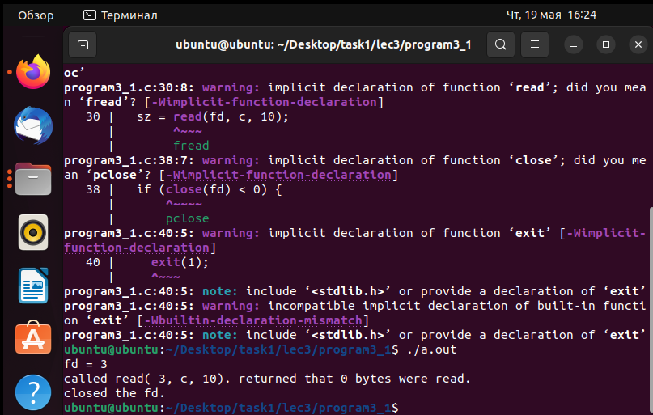

# Программа 3_1 
Сначала программа просит выделяет память для массива элементов типа char (12ая строчка). Затем приложение открывает файл foo.txt для чтения и необходимости создания (15ая строчка). Затем происходит вывод значения дескриптора файла(18ая строчка). После этого приложение прочтёт из файла 10 байт и запишет полученное количество информации в переменную sz (30ая строчка). Затем программа запишет в конец массива терминальный ноль (35ая строчка) и закроет файл (38ая строчка).
# скриншоты

